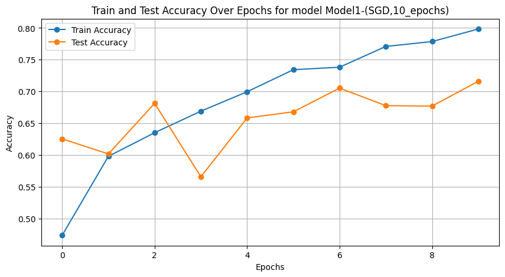

# Image classification using Pytorch 
#### Try youself: 
[](https://github.com/vaibhavingale-sjsu/deeplearning/blob/main/image_classification/training.ipynb)


## Dataset: 
#### Download URL: 
https://huggingface.co/datasets/miladfa7/Intel-Image-Classification/blob/main/archive.zip

### Context: 
This is image data of Natural Scenes around the world.

### Content:
This Data contains around 25k images of size 150x150 distributed under 6 categories.
```
    {
    'buildings' -> 0,
    'forest' -> 1,
    'glacier' -> 2,
    'mountain' -> 3,
    'sea' -> 4,
    'street' -> 5 
    }
```
The Train, Test and Prediction data is separated in each folders. There are around 14k images in Train, 3k in Test and 7k in Prediction.

## Models: 
Following models have been tried with same number of epochs to compare the results:

1. Adam (adaptive moment estimation)
1. SGD (stochastic gradient descent)
1. RMSprop (root mean square propagation)
1. AdaGrad (adaptive gradient algorithm)


## Evaluation:

### Loss over epochs for each model: 

####  Adam


#### SGD


#### RMSprop


#### AdaGrad


### Compare the results of each model with following metrics:
 Training and Testing accuracy per epoch: 
 


## Conclusion:

| Model | Optimization | Epochs | Accuracy | Precision | Recall | F1 Score |
|-------|--------------|--------|----------|-----------|--------|----------|
| Model1 | SGD | 10 | 0.7523 | 0.7582 | 0.7523 | 0.7537 |
| Model2 | Adam | 10 | 0.7467 | 0.7575 | 0.7467 | 0.7465 |
| Model3 | RMSprop | 10 | 0.7030 | 0.7105 | 0.7030 | 0.7023 |
| Model4 | AdaGrad | 10 | 0.7493 | 0.7535 | 0.7493 | 0.7502 |


From the above table, we can conclude that SGD optimizer gives the best results for this dataset.

