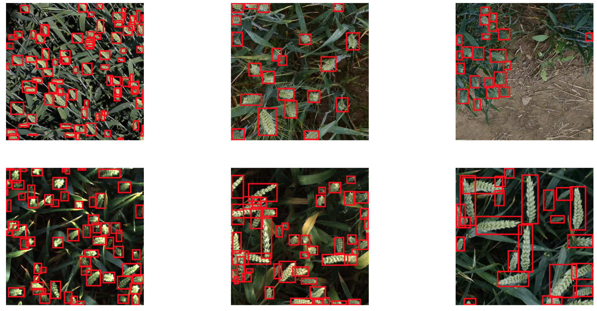
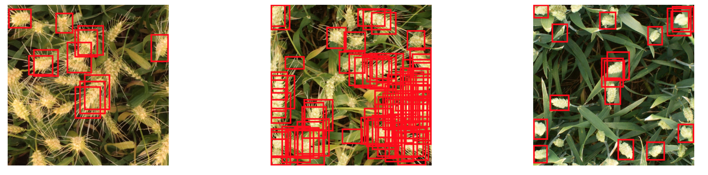

# Object Detection using Yolov8

## Dataset: Global Wheat Head Dataset 
#### Download URL: 
https://www.kaggle.com/competitions/global-wheat-detection

### Context: 
More details on the data acquisition and processes are available at https://arxiv.org/abs/2005.02162


### Dataset Structure
The Global Wheat Head Dataset is organized into two main subsets:

Training Set: This subset contains over 3,000 images from Europe and North America. The images are labeled with wheat head bounding boxes, providing ground truth for training object detection models.
Test Set: This subset consists of approximately 1,000 images from Australia, Japan, and China. These images are used for evaluating the performance of trained models on unseen genotypes, environments, and observational conditions.

### Content:
### Files
- train.csv - the training data
- sample_submission.csv - a sample submission file in the correct format
- train.zip - training images
- test.zip - test images

#### Columns
- image_id - the unique image ID
- width, height - the width and height of the images
- bbox - a bounding box, formatted as a Python-style list of [xmin, ymin, width, height]

#### Classes
```
names:
  0: wheat_head
```

The data is split into train and valid split with `test_size=0.2` and `random_state=1`

## Models: 
Following models have been tried with 3 epochs to compare the results:

1. Auto (default)
1. SGD (stochastic gradient descent)
1. Adam (adaptive moment estimation)


## Training and Evaluation:


###  Adam
Hyperparameter: 
- Optimizer: Adam
- Momentum: 0.95
- Close Mosaic: 10
- Name: adam_aug

Training Summary:

| epoch | train/box_loss | train/cls_loss | train/dfl_loss | metrics/precision(B) | metrics/recall(B) | metrics/mAP50(B) | metrics/mAP50-95(B) | val/box_loss | val/cls_loss | val/dfl_loss | lr/pg0 | lr/pg1 | lr/pg2 |
| --- | --- | --- | --- | --- | --- | --- | --- | --- | --- | --- | --- | --- | --- |
| 1   | 2.6559 | 28.419 | 2.6019 | 0.46698 | 0.42439 | 0.41325 | 0.15074 | 2.4053 | 36.824 | 2.2572 | 0.070178 | 0.0033136 | 0.0033136 |
| 2   | 2.1966 | 22.976 | 2.0692 | 0.66388 | 0.59418 | 0.62721 | 0.25742 | 2.1672 | 21.564 | 2.1501 | 0.037984 | 0.0044535 | 0.0044535 |
| 3   | 2.0731 | 20.649 | 1.9824 | 0.69231 | 0.61801 | 0.67576 | 0.28025 | 2.0394 | 20.502 | 2.0393 | 0.0035905 | 0.0033933 | 0.0033933 |

### SGD
Hyperparameter:
- Optimizer: SGD
- Momentum: 0.8
- Close Mosaic: 0
- Name: sgd_noaug

Training Summary:
|epoch                  |train/box_loss         |train/cls_loss         |train/dfl_loss         |metrics/precision(B)   |metrics/recall(B)      |metrics/mAP50(B)       |metrics/mAP50-95(B)    |val/box_loss           |val/cls_loss           |val/dfl_loss           |lr/pg0                 |lr/pg1                 |lr/pg2                 |
|-----------------------|-----------------------|-----------------------|-----------------------|-----------------------|-----------------------|-----------------------|-----------------------|-----------------------|-----------------------|-----------------------|-----------------------|-----------------------|-----------------------|
|                      1|                  3.214|                 29.559|                 3.7552|                 0.3514|                0.38748|                0.29764|                 0.0918|                 2.8867|                 26.368|                 3.4857|               0.070178|              0.0033136|              0.0033136|
|                      2|                 2.9417|                  26.43|                 3.3553|                0.44498|                0.46866|                0.40614|                0.13369|                 2.6292|                  24.67|                 3.1934|               0.037984|              0.0044535|              0.0044535|
|                      3|                  2.729|                 24.779|                 3.1693|                0.52476|                0.47825|                0.47762|                0.16867|                 2.5533|                 23.519|                 3.1032|              0.0035905|              0.0033933|              0.0033933|


### Auto
Training Summary:
|epoch                  |train/box_loss         |train/cls_loss         |train/dfl_loss         |metrics/precision(B)   |metrics/recall(B)      |metrics/mAP50(B)       |metrics/mAP50-95(B)    |val/box_loss           |val/cls_loss           |val/dfl_loss           |lr/pg0                 |lr/pg1                 |lr/pg2                 |
|-----------------------|-----------------------|-----------------------|-----------------------|-----------------------|-----------------------|-----------------------|-----------------------|-----------------------|-----------------------|-----------------------|-----------------------|-----------------------|-----------------------|
|                      1|                 2.6559|                 28.419|                 2.6019|                0.46698|                0.42439|                0.41325|                0.15074|                 2.4053|                 36.824|                 2.2572|               0.070178|              0.0033136|              0.0033136|
|                      2|                 2.1966|                 22.976|                 2.0692|                0.66388|                0.59418|                0.62721|                0.25742|                 2.1672|                 21.564|                 2.1501|               0.037984|              0.0044535|              0.0044535|
|                      3|                 2.0731|                 20.649|                 1.9824|                0.69231|                0.61801|                0.67576|                0.28025|                 2.0394|                 20.502|                 2.0393|              0.0035905|              0.0033933|              0.0033933|


### Compare the results of each model with following metrics:
 Training and Testing accuracy per epoch: (used only 3 epoch for each model)
 

 ## Prediction Results:

#### With Auto model selection: 
 

#### With SGD model selection:

 

## Conclusion:

### For SGD:
| Class | Images | Instances | Box(P) | R | mAP50 | mAP50-95 |
|-------|--------|-----------|--------|---|-------|----------|
| all   | 675    | 30043     | 0.526  | 0.478 | 0.478 | 0.169   |
| wheat | 675    | 30043     | 0.526  | 0.478 | 0.478 | 0.169   |

### For Adam:
| Class | Images | Instances | Box(P) | R | mAP50 | mAP50-95 |
|-------|--------|-----------|--------|---|-------|----------|
| all   | 675    | 30043     | 0.694  | 0.617 | 0.676 | 0.28    |
| wheat | 675    | 30043     | 0.694  | 0.617 | 0.676 | 0.28    |

### For Auto:
| Class | Images | Instances | Box(P) | R | mAP50 | mAP50-95 |
|-------|--------|-----------|--------|---|-------|----------|
| all   | 675    | 30043     | 0.694  | 0.617 | 0.676 | 0.28    |
| wheat | 675    | 30043     | 0.694  | 0.617 | 0.676 | 0.28    |


From the above table, we can conclude that Adan optimizer gives the best results for this dataset which may be auto selected while training.

### Things did not work for me:
However above section shows the evaluation using yolo metrics, I have tried converting the dataset into coco format, once the evaluation is done, I was getting values as 0 for all the metrics.

```
Running per image evaluation...
Evaluate annotation type *bbox*
DONE (t=1.41s).
Accumulating evaluation results...
DONE (t=0.23s).
 Average Precision  (AP) @[ IoU=0.50:0.95 | area=   all | maxDets=100 ] = 0.000
 Average Precision  (AP) @[ IoU=0.50      | area=   all | maxDets=100 ] = 0.000
 Average Precision  (AP) @[ IoU=0.75      | area=   all | maxDets=100 ] = 0.000
 Average Precision  (AP) @[ IoU=0.50:0.95 | area= small | maxDets=100 ] = 0.000
 Average Precision  (AP) @[ IoU=0.50:0.95 | area=medium | maxDets=100 ] = 0.000
 Average Precision  (AP) @[ IoU=0.50:0.95 | area= large | maxDets=100 ] = 0.000
 Average Recall     (AR) @[ IoU=0.50:0.95 | area=   all | maxDets=  1 ] = 0.000
 Average Recall     (AR) @[ IoU=0.50:0.95 | area=   all | maxDets= 10 ] = 0.000
 Average Recall     (AR) @[ IoU=0.50:0.95 | area=   all | maxDets=100 ] = 0.000
 Average Recall     (AR) @[ IoU=0.50:0.95 | area= small | maxDets=100 ] = 0.000
 Average Recall     (AR) @[ IoU=0.50:0.95 | area=medium | maxDets=100 ] = 0.000
 Average Recall     (AR) @[ IoU=0.50:0.95 | area= large | maxDets=100 ] = 0.000
```